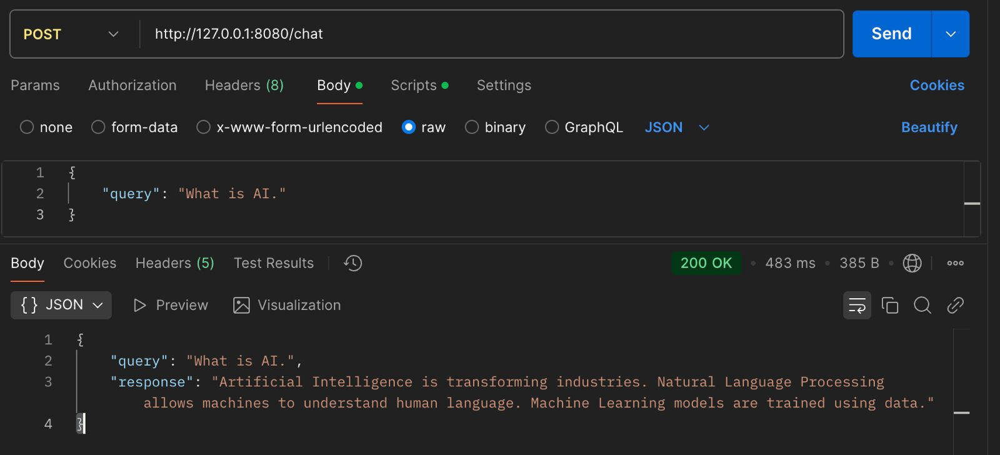

# 🧠 RAG Chatbot - Retrieval-Augmented Generation Chatbot

This is a **Retrieval-Augmented Generation (RAG) Chatbot** that retrieves relevant text chunks using **FAISS** and generates responses based on a **vector database**.


- Retrieves relevant text chunks from a vector database (FAISS)
- Uses a language model (LLM) to generate answers
- Stores chat history in a local SQLite database
- Provides a Flask API for interacting with the chatbot

## 🌟 Features
- Retrieval-based search using FAISS
- Embeddings generated with sentence-transformers
- Stores chat history in SQLite (chat_history.db)
- Flask API for chatbot interaction (POST /chat & GET /history)
- Dockerized for easy deployment


## 🚀 Setup & Usage
### 1. Installation & Setup

### 1.1 Clone the Repository
```
git clone https://github.com/Megatron91/RAG-Chatbot.git
cd RAG-Chatbot
```
### 1.2 Create & Activate Virtual Environment (Recommended)
```
python -m venv venv
source venv/bin/activate  # For Linux/macOS
venv\Scripts\activate  # For Windows
```

### 1.3 Install Dependencies
` pip install -r requirements.txt `

## 2. Database Setup (SQLite)

This project uses **SQLite3** to store chat history in chat_history.db.
No additional database setup is required—SQLite works out-of-the-box.

## 3. Running the Chatbot

### 3.1 Preprocess Data & Create Vector Database
```
python data_preprocessing.py
python embed_store.py
```
### 3.2 Start the Flask API

`python app.py`

 The API will start at: http://127.0.0.1:8080/

 ## 4. API Testing

 ### 4.1 Using curl

 `curl -X POST http://127.0.0.1:5000/chat -H "Content-Type: application/json" -d '{"user_query": "What is artificial intelligence?"} `

 ## 4.2 Using Python

```
import requests

url = "http://127.0.0.1:8080/chat"
data = {"user_query": "What is artificial intelligence?"}

response = requests.post(url, json=data)
print(response.json())  # Expected Output: {"answer": "AI is ..."}

```

### 4.3 Using Postman
1.	Open Postman and create a new POST request.
2.	Enter the URL: http://127.0.0.1:8080/chat
3.	Set Headers: `Content-Type: application/json`
4.	Enter JSON Body:
```json
{
  "query": "What is artificial intelligence?"
} 
```
5.	Click Send and check the response.



## 5. Running with Docker

### 5.1 Run Pre-Built Docker Image from Docker Hub
```
docker pull 812693/rag-chatbot
docker run -p 5000:5000 812693/rag-chatbot
```

### 5.2 Test API Inside the Container
 ```
 curl -X POST http://127.0.0.1:8080/chat -H "Content-Type: application/json" -d '{"user_query": "What is artificial intelligence?"}'
 ```

#### Check Chat-History
```
curl -X GET http://127.0.0.1:8080/history
```

## 6. Chat History Storage
The chatbot stores all user & system messages in chat_history.db.

### 6.1 View Stored Conversations through sqlilte3
` sqlite3 chat_history.db "SELECT * FROM chat_history;" `

## 7. Project Structure

```
├── app.py                      # Flask API for chatbot interaction
├── chat_history.db              # SQLite database storing chat history
├── chunks.csv                   # Preprocessed text chunks
├── data_preprocessing.py         # Prepares text & creates vector database
├── embed_store.py                # Generates embeddings & stores in FAISS
├── rag_chatbot.py                # Core chatbot logic (retrieval + generation)
├── vector_store.faiss            # FAISS vector database
├── requirements.txt              # List of dependencies
├── Dockerfile                    # Docker container setup
└── README.md                     # Documentation

```
